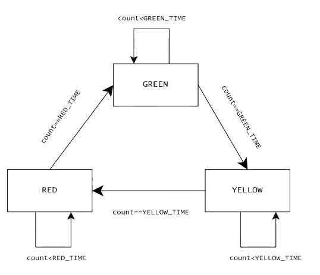
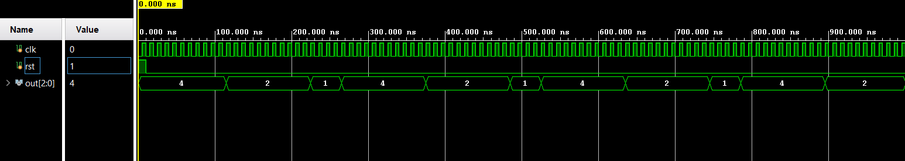
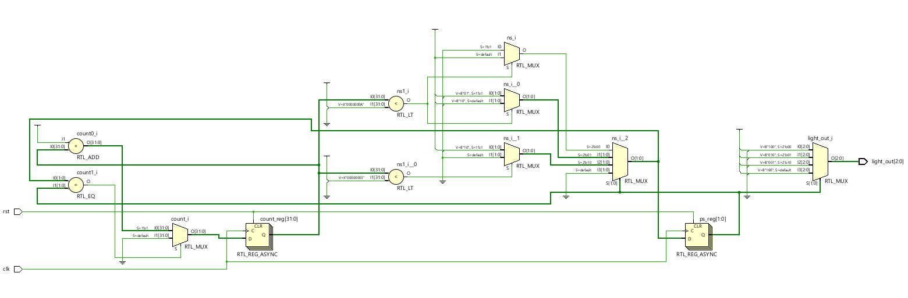

# Traffic Light Controller using verilog

A simple FSM-based traffic light controller implemented using verilog in AMD Vivado

### Features
- 3-state Moore machine ( Red->Green->Yellow->Red )
- Parameterized timing counters for each light ( Red=10s, Green=10s, Yellow=3s )
- Completely synthesizable for FGPA implementation

## State Diagram


## Waveform


## Schematic


## Steps to run
1. Simulate with **Icarus Verilog**:
   ```verilog
   iverilog -o tlc TrafficLightController.v tbltc.v
   vvp tlc
2. View the Waveform with **GTKWAVE**:
   ```verilog
   gtkwave tlc.vcd